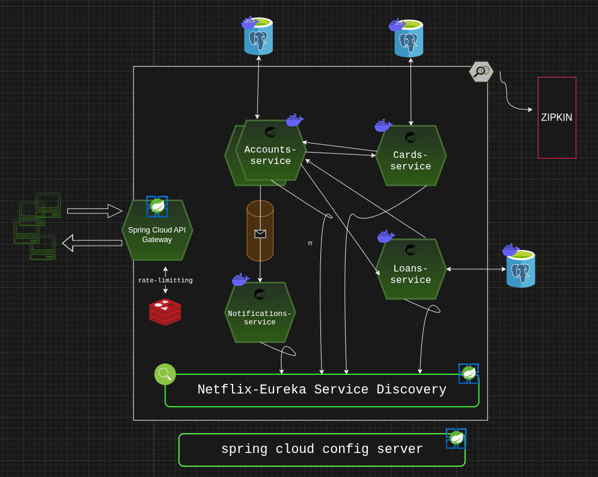
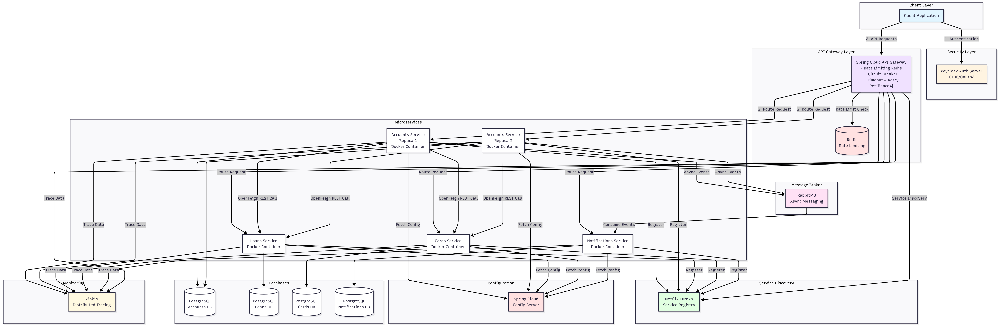

# 🏦 Banking Microservices System

A comprehensive, production-grade microservices architecture for banking operations, built with **Spring Boot** and **Spring Cloud** ecosystem, featuring advanced patterns for resilience, observability, and security.

---

## 🌟 System Overview



This system demonstrates a complete microservices implementation with industry-standard patterns including service discovery, centralized configuration, API gateway, distributed tracing, and event-driven architecture.

---

## 🎯 Architecture Highlights

### **Core Business Services**
- **👤 Accounts Service** - Customer account management
- **💳 Cards Service** - Credit/Debit card operations
- **💰 Loans Service** - Loan application and management
- **📧 Notifications Service** - Asynchronous notification handling

### **Infrastructure Services**
- **🌐 Spring Cloud API Gateway** - Single entry point with intelligent routing
- **🔍 Netflix Eureka** - Service discovery and registration
- **⚙️ Spring Cloud Config Server** - Centralized configuration management
- **🔐 Keycloak** - Centralized authentication and authorization (OIDC)
- **📊 Zipkin** - Distributed tracing and observability
- **🐰 RabbitMQ** - Event-driven async communication
- **🗄️ PostgreSQL** - Dedicated database per service

---

## 🏗️ Detailed System Design



### **Key Architectural Patterns**

#### 1️⃣ **API Gateway Pattern**
- Single entry point for all client requests
- Request routing to appropriate microservices
- Cross-cutting concerns (authentication, rate limiting, logging)

#### 2️⃣ **Service Discovery**
- Dynamic service registration with Eureka
- Client-side load balancing
- Health monitoring and failover

#### 3️⃣ **Resilience Patterns** (Resilience4j)
- **Circuit Breaker** - Prevents cascading failures
- **Rate Limiting** - Controls request flow (Redis-backed)
- **Retry** - Automatic retry with exponential backoff
- **Timeout** - Request timeout management

#### 4️⃣ **Event-Driven Architecture**
- **Spring Cloud Stream** - Message broker abstraction layer
- **Function-based bindings** - Decoupled from specific broker implementation
- Asynchronous communication between Accounts → Notifications
- RabbitMQ as message broker for reliable event delivery
- Event triggers: Account creation & transaction events
- Decoupled services for better scalability

#### 5️⃣ **Database per Service**
- Each microservice owns its PostgreSQL database
- Data isolation and independence
- Polyglot persistence enabled

#### 6️⃣ **Synchronous Communication**
- REST calls using **Spring Cloud OpenFeign**
- Declarative REST client with load balancing
- Inter-service communication (Accounts ↔ Loans/Cards)

---

## 🔐 Security Architecture

### **Keycloak Integration (OIDC)**
- Centralized authentication server
- OAuth 2.0 / OpenID Connect protocol
- Token-based authentication (JWT)
- Role-based access control (RBAC)
- Single Sign-On (SSO) capability

### **Security Flow**
```
Client → API Gateway → Keycloak (Auth) → Microservices
```

---

## 📡 Communication Patterns

### **Synchronous (REST)**
```
Accounts Service → OpenFeign → Loans Service
Accounts Service → OpenFeign → Cards Service
```
*Used for fetching customer financial details in real-time*

### **Asynchronous (Event-Driven)**
```
Accounts Service → RabbitMQ → Notifications Service
```
*Used for non-blocking notification delivery*

---

## 🛡️ Resilience & Reliability

### **Gateway-Level Protection**
| Pattern | Implementation | Purpose |
|---------|---------------|---------|
| **Rate Limiting** | Redis-backed | Prevent API abuse, ensure fair usage |
| **Circuit Breaker** | Resilience4j | Stop cascading failures |
| **Timeout** | Resilience4j | Prevent hanging requests |
| **Retry** | Resilience4j | Handle transient failures |

### **High Availability**
- Health checks and automatic failover
- Load balancing across service instances
- Distributed session management

---

## 📊 Observability & Monitoring

### **Distributed Tracing (Zipkin)**
- End-to-end request tracking across services
- Performance bottleneck identification
- Service dependency visualization
- Latency analysis

### **Tracing Flow**
```
API Gateway → Accounts → Loans/Cards → Database
         ↓
    Zipkin (Trace Collection)
```

---

## 🐳 Containerization

All services are **fully containerized** using Docker:
- Consistent deployment across environments
- Easy scaling and orchestration
- Isolated runtime environments
- Infrastructure as Code

---

## 🚀 Technology Stack

### **Backend**
- ☕ **Java** / **Spring Boot**
- 🌤️ **Spring Cloud** (Gateway, Config, OpenFeign, Stream)
- 🎬 **Netflix Eureka** (Service Discovery)
- 💪 **Resilience4j** (Resilience Patterns)

### **Databases**
- 🐘 **PostgreSQL** (per microservice)
- 🔴 **Redis** (Rate Limiting)

### **Messaging**
- 🐰 **RabbitMQ** (Event Streaming)

### **Security**
- 🔐 **Keycloak** (Identity & Access Management)
- 🎫 **OIDC / OAuth 2.0**

### **Observability**
- 🔭 **Zipkin** (Distributed Tracing)

### **DevOps**
- 🐳 **Docker** (Containerization)

---

## 📁 Project Structure

```
├── accounts-service/          # Customer accounts management
├── loans-service/             # Loan operations
├── cards-service/             # Card management
├── notifications-service/     # Async notifications
├── api-gateway/               # Spring Cloud Gateway
├── eureka-server/             # Service discovery
├── config-server/             # Centralized configuration
├── docker-compose.yml         # Container orchestration
└── docs/                      # Architecture diagrams
    ├── banking-system-microservices-arch.png
    └── detailed-system-design-view.png
```

---

## 🎯 Key Features

✅ **Scalable Architecture** - Independent service scaling  
✅ **Fault Tolerance** - Circuit breakers and retry mechanisms  
✅ **Security First** - Centralized auth with Keycloak  
✅ **Event-Driven** - Async communication for better performance  
✅ **Observable** - Complete distributed tracing  
✅ **Resilient** - Multiple failure-handling patterns  
✅ **Cloud-Native** - Containerized and orchestratable  
✅ **Database Isolation** - Service-specific data stores  

---

## 🔧 Environment Profiles

The system supports multiple deployment profiles to optimize resource usage and testing:

### **Local / Default Profile**
- **Database**: PostgreSQL (dedicated per service)
- **Runtime**: Applications run locally on host machine
- **Purpose**: Development and debugging with full database features
- **Memory**: Optimized for 8GB RAM systems

### **QA Profile**
- **Database**: H2 (in-memory)
- **Runtime**: All services containerized with Docker
- **Purpose**: Integration testing and CI/CD pipelines
- **Memory**: Lightweight for resource-constrained environments

This dual-profile approach ensures developers can work efficiently on limited hardware while maintaining production-like PostgreSQL databases for local development.

---

## 🔄 Inter-Service Communication

### **REST (Synchronous)**
Used when immediate response is required for fetching customer financial details across services using Spring Cloud OpenFeign.

### **Messaging (Asynchronous)**
Implemented with **Spring Cloud Stream** for message broker abstraction:
- **Bindings**: Configured for Accounts → Notifications communication
- **Event Types**: 
  - Account creation events
  - Transaction events
- **Benefits**: Broker-agnostic implementation, easy to switch from RabbitMQ to Kafka if needed

---

## 🚦 Getting Started

### **Prerequisites**
- Java 17+
- Docker & Docker Compose
- Maven

### **Run the System**
```bash
# Start all services
docker-compose up -d

# Access services
- API Gateway: http://localhost:8080
- Eureka Dashboard: http://localhost:8761
- Zipkin UI: http://localhost:9411
- Keycloak Admin: http://localhost:8180
```

---

## 📈 Future Enhancements

- 📊 **Monitoring & Observability** - Prometheus & Grafana for metrics and dashboards
- 🔒 **Enhanced Security** - mTLS for service-to-service communication
- 🧪 **Contract Testing** - Pact for consumer-driven contracts
- 🔄 **Advanced Messaging** - Event sourcing and CQRS patterns

---

## 🤝 Contributing

Contributions are welcome! Please feel free to submit a Pull Request.

---

## 📄 License

This project is licensed under the MIT License.

---

## 📧 Contact

For questions and support, please open an issue in the repository.

---

**Built with ❤️ using Spring Cloud & Microservices Best Practices**
